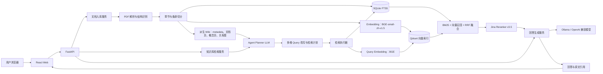

# 规智库

[](https://www.python.org/)
[](https://fastapi.tiangolo.com/)
[](https://react.dev/)
[](https://www.typescriptlang.org/)
[](https://tailwindcss.com/)
[](https://qdrant.tech/)
[](https://www.sqlite.org/)
[](https://ollama.com/)
[](https://huggingface.co/BAAI/bge-small-zh-v1.5)
[](https://huggingface.co/jinaai/jina-reranker-v3.5)

## 概述

规智库是面向建筑工程规范、技术标准、企业制度和法律法规的智能知识库。
系统支持上传文本型或扫描型 PDF，将文档解析为带章节、条款和页码信息的结构化内容，
并通过关键词与语义检索、证据排序和大模型生成，为用户提供可追溯到 PDF 原页的问答结果。

当前版本优先面向单机知识库场景，适合管理少量一两百页、单份不超过 100 MB 的规范文档。
系统可以在未连接大模型时返回原文证据，也可以连接 Ollama 或兼容 OpenAI 协议的模型生成综合回答。

## 核心特性

- 单次上传一份 PDF，知识库可连续加入多份文档。
- 支持 100 MB、600 页以内的文本型或扫描型 PDF。
- 默认通过 OpenDataLab PDF-Extract-Kit 管线解析 PDF，优先保留表格、图片、章节、条款和页码结构。
- 条款、章节、正文、表格、图片位置、PDF 页码和纸面页码结构化。
- SQLite FTS5 BM25 + 本地 BGE 中文向量召回 + Qdrant Local + RRF + Jina Rerank。
- 单文档问答、跨文档综合回答和新旧规范对比。
- 对比类问题带轻量 Agentic 编排：Planner LLM 自动拆解多维度检索计划，并行检索后按文档组织资料包。
- Planner 会参考数据库中的 READY 文档目录和 Wiki `metadata.json` 摘要、主题、概念，再生成受控的多步检索计划；最终答案仍只以原文检索资料为依据。
- Wiki Markdown 用于人工浏览、概念导航、chunk 原文锚点和关系计算，不会把全部页面一次性塞入 Planner；详细页面后续按需读取。
- 流式回答接口记录检索耗时、首 token 时间和总耗时，方便持续调优。
- 回答末尾附引用，引用卡片可跳转到 PDF 原页。
- 区分规范正文与条文说明，确定性结论优先规范正文。
- BGE 模型未下载时，系统仍可通过 BM25 完成检索和原文引用；下载模型后执行 `reindex` 启用语义向量召回。

## 项目架构



Wiki 是基于解析结果和 chunks 生成的派生知识层，不替代 SQLite、Qdrant 或 PDF 原文：

```text
ParsedDocument + Chunk
  -> WikiManager._analyze()
  -> storage/wiki/metadata/{document_id}.json
  -> documents/*.md、concepts/*.md、overview.md、related.json
  -> Planner 读取 metadata 的摘要、主题和概念
  -> 最终仍回到 BM25、向量检索和重排序获取原文资料
```

Planner 当前读取的 Wiki 信息是轻量 metadata，不是所有 Markdown 页面。详细 Wiki 页面用于人工浏览、交叉链接、chunk 锚点和关系图；未来可通过 `search_wiki`、`get_related_pages` 按需扩展 Planner 上下文。

数据处理主流程：

```text
PDF 上传
  → PDF-Extract-Kit 全量文档解析
  → 章节、条款、表格、图片位置和页码结构化
  → 文本块切分
  → BM25 全文索引与 BGE 向量索引
  → Agent Planner 生成多维检索计划
  → 并行召回、RRF 融合与 Jina 重排序
  → 大模型依据资料生成回答
  → 引用回链 PDF 原页
```

## 关键模块

| 模块 | 位置 | 职责 |
| --- | --- | --- |
| Web 工作台 | `frontend/app/RagDashboard.tsx` | 知识库管理、文档选择、问答和引用查看 |
| API 入口 | `backend/src/backend/main.py` | 健康检查、文档、任务、文件和问答接口 |
| 文档解析 | `backend/src/backend/parser.py` | 默认 PDF-Extract-Kit 管线解析 PDF，并保留表格、图片和版面信息 |
| 文档入库 | `backend/src/backend/ingestion.py` | 解析、切分、索引和任务状态编排 |
| Wiki 派生层 | `backend/src/backend/wiki.py` | 基于解析产物生成带 chunk 锚点的文档页、概念页和 Planner 上下文 |
| 文本切分 | `backend/src/backend/chunking.py` | 按章节、条款和页码生成检索块 |
| 检索编排 | `backend/src/backend/retrieval.py` | 条款定位、全文检索、向量检索、跨文档平衡和结果融合 |
| Agentic 检索 | `backend/src/backend/agent.py` | LLM JSON 规划、多维度查询改写、并行检索步骤和回退计划 |
| 数据仓储 | `backend/src/backend/repository.py` | 文档、任务、文本块和全文索引持久化 |
| 向量索引 | `backend/src/backend/vector_index.py` | Qdrant 集合管理与相似度查询 |
| 模型服务 | `backend/src/backend/providers.py` | Embedding、Rerank 和回答模型适配 |
| 问答服务 | `backend/src/backend/service.py` | 检索、生成、引用和证据状态整理 |

## 快速开始

双击项目根目录的 `start.cmd`，或在 PowerShell 中运行：

```powershell
cd E:\lmq\RAG_ZB
.\start.cmd
```

启动后访问：

- Web：http://localhost:3000
- API 文档：http://127.0.0.1:8000/docs

按 `Ctrl+C` 停止前后端。

### 使用本地 Ollama

确认 Ollama 已启动并存在目标模型：

```powershell
ollama list
```

项目根目录 `.env` 示例：

```dotenv
RAG_OPENAI_BASE_URL=http://127.0.0.1:11434/v1
RAG_OPENAI_API_KEY=ollama-local
RAG_CHAT_MODEL=jewelzufo/MiniCPM5-1B
RAG_CHAT_MAX_TOKENS=2048
RAG_CHAT_THINK=false
```

Ollama 通过 OpenAI 兼容接口接入，修改配置后需要重启后端。

## 目录结构

```text
RAG_ZB/
├─ backend/                  # FastAPI 后端
│  ├─ src/backend/          # 业务源代码
│  ├─ tests/                # 后端测试
│  ├─ .venv/                # 项目级 Python 环境
│  └─ pyproject.toml        # Python 依赖与工具配置
├─ frontend/                 # React Web
│  ├─ app/                  # 页面与全局样式
│  ├─ components/ui/        # shadcn/ui 组件
│  ├─ public/               # favicon 和社交预览资源
│  └─ package.json          # 前端依赖与脚本
├─ scripts/                  # 启动和辅助脚本
├─ storage/                  # PDF、解析结果、SQLite、Qdrant 和派生 Wiki
├─ .models/                  # 可选本地解析模型
├─ .tools/                   # 项目级工具、缓存和运行依赖
├─ .env                      # 本地运行配置，不提交 Git
├─ .env.example              # 环境变量模板
├─ start.cmd                 # Windows 一键启动
└─ 规范智能问答系统-当前架构.xmind
```

## 环境隔离

- Python 3.12 环境：`backend\.venv`
- uv、npm CLI 及缓存：`.tools`
- MinerU 模型：`.models`
- 文档、SQLite 和 Qdrant 数据：`storage`
- 前端依赖：`frontend\node_modules`

项目不做全局安装，也不会自动修改 `.env`、系统 PATH 或系统配置。

默认解析链路使用 `pdf-extract-kit` 管线。解析模型和缓存固定在项目 `.models` 目录，避免污染系统缓存。
如果只是调试轻量 OCR，可临时设置 `RAG_SCAN_PARSER=rapidocr`，但表格和图片位置效果会弱于 PDF-Extract-Kit。

## 外部模型配置

应用只读取 `RAG_` 前缀的环境变量。不要把真实密钥写入代码或提交到 Git。

PowerShell 当前终端示例：

```powershell
$env:RAG_OPENAI_BASE_URL = "https://your-provider.example/v1"
$env:RAG_OPENAI_API_KEY = "your-key"
$env:RAG_CHAT_MODEL = "your-chat-model"
$env:RAG_EMBEDDING_MODEL = "your-embedding-model"
$env:RAG_EMBEDDING_DIMENSION = "1024"

$env:RAG_RERANK_BASE_URL = "https://your-provider.example/v1/rerank"
$env:RAG_RERANK_API_KEY = "your-key"
$env:RAG_RERANK_MODEL = "your-rerank-model"

.\start.cmd
```

### Chat 接口约定

请求：

```json
{
  "model": "model-name",
  "temperature": 0.1,
  "messages": [
    {"role": "system", "content": "..."},
    {"role": "user", "content": "..."}
  ]
}
```

返回读取：

```json
{
  "choices": [
    {"message": {"content": "回答正文"}}
  ]
}
```

### Embedding 接口约定

请求：

```json
{
  "model": "embedding-model",
  "input": ["文本1", "文本2"],
  "dimensions": 1024
}
```

返回读取：

```json
{
  "data": [
    {"index": 0, "embedding": [0.1, 0.2]}
  ]
}
```

### Rerank 接口约定

请求：

```json
{
  "model": "rerank-model",
  "query": "用户问题",
  "documents": ["候选1", "候选2"],
  "top_n": 8,
  "return_documents": false
}
```

返回读取：

```json
{
  "results": [
    {"index": 1, "relevance_score": 0.93}
  ]
}
```

如果供应商字段不同，应修改 `backend/src/backend/providers.py` 中对应 Provider，不能直接假定兼容。

### 跨文档对比

对比类问题会先经过轻量查询规划，不依赖 LangChain 或 LlamaIndex：

```text
识别 comparison
  → Planner LLM 生成 JSON 检索计划
  → 拆成多条覆盖不同维度的检索语句
  → 并行执行 search_general / search_in_document
  → 合并、去重、重排并做文档间平衡
  → 按文档分组组织资料包
  → LLM 输出结论、对比要点和资料不足
```

如果问题中包含 `GB55037-2022`、`GB50016-2014` 这类标准号，系统会优先按标准号匹配 READY 文档。
如果只问“新旧规范”，系统会在可检索文档中按版本尝试选择新旧文档。前端手动勾选文档时，以手动选择为准。

当前效果相比早期单次检索更稳定：跨文档、对比和资料不足类问题会先生成多条查询改写，再从不同文档和维度补充召回，减少只命中文档开头总说明、前言或目录的情况。

更多工程说明：

- [项目总览](doc/01-overview.md)
- [Agentic RAG 与 Planner](doc/11-agentic-rag.md)
- [Wiki 派生知识层](doc/12-wiki-layer.md)

## 开发验证

后端：

```powershell
$env:UV_CACHE_DIR = "E:\lmq\RAG_ZB\.tools\uv-cache"
E:\lmq\RAG_ZB\.tools\uv\bin\uv.exe run --project backend ruff check backend
E:\lmq\RAG_ZB\.tools\uv\bin\uv.exe run --project backend pytest -q
```

前端：

```powershell
$node = "C:\Users\PC\.cache\codex-runtimes\codex-primary-runtime\dependencies\node\bin\node.exe"
& $node ".tools\npm-cli\package\bin\npm-cli.js" run build --prefix frontend
```

## 首版边界

- 当前无登录、多租户和批量上传。
- Qdrant Local 适用于初期少量规范；规模扩大后应迁移为独立 Qdrant 服务。
- 默认本地 Embedding 为 `BAAI/bge-small-zh-v1.5`；模型下载后需重启后端并对已有资料执行 `reindex`。哈希向量仅作为显式调试后端保留。
- 服务启动阶段会分别预热 BGE 和 Jina，消除第一条问答的模型冷启动等待；显存紧张时可在 `config.py` 中关闭对应预热开关。
- 条件判断、合规和法律问题只提供文档依据，不替代专业审查或法律意见。
