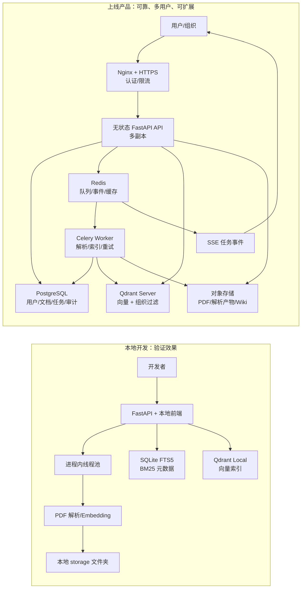
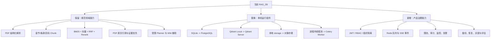

# RAG_ZB 多人部署演进计划

> 目标：在保留“规范条款可追溯问答”能力的前提下，将当前单机 MVP 演进为可供团队使用的服务。
>
> 本文参考 `E:\lmq\designflow\docs\系统设计\designflow-functional-map.md` 的职责拆分方式：认证、关系型数据库、对象存储、任务队列、独立 Worker、实时通知和反向代理。仅借鉴基础设施模式，不复制其图片/视频、积分、工作空间等业务。

## 1. 当前事实与边界

当前检索并非“SQLite 或 BM25 二选一”。SQLite 是存储引擎，SQLite FTS5 是全文检索能力，实际流程为：

```text
PDF -> 解析与切块
    -> SQLite documents / jobs / chunks 元数据
    -> SQLite FTS5：BM25 关键词召回
    -> Qdrant Local：BGE 语义向量召回
    -> RRF 融合 -> Rerank -> 带页码引用的回答
```

- `backend/src/backend/repository.py` 的 `bm25_search()` 使用 SQLite FTS5 的 `bm25()`。
- `backend/src/backend/retrieval.py` 同时执行 BM25 与向量召回，并以 RRF 融合；没有本地 BGE 时仍可仅用 BM25 返回原文引用。
- 当前 `storage/rag.db`、`storage/qdrant` 与进程内 `ThreadPoolExecutor` 适合单机、少量规范和单 API 进程，不适合直接横向扩容。

## 2. 目标架构

```text
浏览器
  -> Nginx / HTTPS
  -> React 前端
  -> FastAPI API（无状态、多副本）
      -> PostgreSQL：用户、组织、文档、任务、chunks 元数据、审计
      -> Redis：Celery broker、任务状态事件、限流、缓存
      -> S3 兼容对象存储：原始 PDF、解析产物、图片、Wiki
      -> Qdrant Server：向量集合与过滤检索
      -> Celery Worker：解析、切块、嵌入、索引、Wiki 生成
      -> SSE：向浏览器推送任务状态
```

原则：API 只校验、授权、创建任务和查询状态；所有耗时操作均由 Worker 执行。最终回答仍只依据原始 chunks 与 PDF 页码，不以 Wiki 派生内容作为证据。

## 2.1 从本地 RAG 到上线产品：差别不在模型，而在系统边界

本地开发版通常只需验证“文档能否被检索、回答是否看起来正确”；上线产品还要保证多人同时使用时的数据隔离、任务可靠性、故障恢复和成本可控。

| 维度 | 常规本地 RAG 开发 | 可上线的多人 RAG 产品 | RAG_ZB 当前状态 |
| --- | --- | --- | --- |
| 使用者 | 单人或开发小组，共享本机目录 | 多用户、多组织、权限不同 | 单机、无登录 |
| 文档存储 | 本地文件夹 | 对象存储 + 文档版本 + 访问控制 | `storage/uploads` 本地磁盘 |
| 元数据/任务 | SQLite 或 JSON 即可 | PostgreSQL + 迁移 + 备份 + 审计 | SQLite，任务表已存在 |
| 关键词检索 | 可选，常被向量检索替代 | 必须保留，条款号/标准号/术语精确命中 | SQLite FTS5 BM25 已实现 |
| 向量检索 | FAISS/Qdrant Local 单机文件 | 独立 Qdrant 服务，带组织过滤与快照 | Qdrant Local |
| 长任务 | API 进程线程、手动等待 | Redis 队列 + 独立 Worker + 重试/取消/死信 | API 进程内线程池 |
| 模型调用 | 单一 API Key，失败直接报错 | Provider 熔断、超时、限额、脱敏日志、成本监控 | 有基础 fallback，缺少租户级控制 |
| 实时进度 | 前端轮询 | Worker 发布事件，API 通过 SSE/WebSocket 推送 | 轮询为主 |
| 安全 | 本机可信环境 | 登录、RBAC、组织隔离、限流、审计、HTTPS | 默认仅本机绑定，无认证 |
| 运维 | 重启即可 | 健康检查、监控、告警、备份、恢复演练 | 仅基础健康检查 |
| 质量 | 人工提问观察 | 黄金集、离线评估、灰度、可追踪引用正确率 | 有引用，缺少系统评估闭环 |

关键判断：**RAG 的“检索链”可以保留，必须替换的是它周围的运行方式。**



## 2.2 不变、替换与新增



不要把“上线”理解为把 SQLite 换成 PostgreSQL 就完成了。真正的上线最小闭环是：

```text
身份已确认 -> 文档权限已确认 -> 任务可重试 -> 文件可持久保存
-> 检索带组织过滤 -> 回答可追溯 -> 事件可观测 -> 故障可恢复
```

## 3. 分阶段计划

### Phase 0：先加固单机版

目的：先消除迁移后仍会出现的数据不一致和并发问题。

1. 修复重解析的原子替换：上传写入临时文件，校验哈希和数据库更新成功后再原子替换旧 PDF。
2. 为文档任务增加数据库级“活动任务唯一性”，避免同一文档同时 reparse/reindex。
3. 将 SQLite chunks 与 Qdrant 写入改为可恢复的索引版本切换；索引失败时保留旧可用版本。
4. 限制 `document_ids` 数量、上传并发与问答并发；统一异常响应，不把内部异常直接返回前端。
5. 对 MinerU ZIP 使用安全解压，校验路径、文件数量与解压后总大小。
6. 补齐原子重解析、索引失败回滚、并发任务、恶意 ZIP 的自动化测试。

验收：单 API 进程下，失败任务不破坏已可用文档与索引；同一文档始终最多一个活动任务。

### Phase 1：账号、组织与权限

目的：允许多人安全使用同一知识库服务。

1. 新增用户、组织、组织成员、角色、文档授权和审计日志模型。
2. 引入 JWT access/refresh token；FastAPI 使用依赖注入进行认证和角色鉴权。
3. 角色最小集：`admin`（成员/文档管理）、`editor`（上传、重解析、重建索引）、`viewer`（检索与查看已授权文档）。
4. 所有 documents、jobs、chunks、Qdrant payload 增加 `organization_id`；每个检索查询必须注入组织过滤条件，不能相信前端传入的 ID。
5. 文件接口、PDF 原页引用和解析图片接口必须校验文档读取权限。
6. API 增加速率限制、请求 ID、审计字段（操作者、时间、来源 IP、资源 ID、动作）。

验收：不同组织之间无法枚举、检索或访问对方 PDF、图片、任务和引用。

### Phase 2：存储与关系库迁移

目的：解除本地磁盘、SQLite 和单机 Qdrant 的限制。

1. SQLite 迁移到 PostgreSQL，建议使用 SQLAlchemy 2 + Alembic；保留 PostgreSQL 全文检索作为 BM25/关键词召回实现。
2. Qdrant Local 迁移到独立 Qdrant Server；collection 或 payload 中包含 `organization_id`、`document_id`、`index_version`。
3. `storage/uploads`、`parsed`、`wiki` 改为 S3 兼容对象存储（MinIO、COS 或 S3）；数据库只保存对象 key、hash、大小和版本。
4. 上传采用预签名 URL：浏览器直传对象存储，API 只创建上传会话和后续入库任务。
5. 制定迁移工具：导出 SQLite 数据和本地文件清单 -> 上传对象存储 -> 导入 PostgreSQL -> 重建 Qdrant -> 抽样校验页码与引用。
6. 切换前做只读备份和可回滚演练；切换期间暂停写入，避免双写不一致。

验收：API 多副本不共享本地磁盘也能访问同一文档；单个服务实例重启不会丢失文档、任务或索引。

### Phase 3：异步任务与实时状态

目的：把解析/嵌入等长任务从 API 进程移出，并可按资源独立扩容。

1. 用 Celery + Redis 替换进程内 `ThreadPoolExecutor`。
2. 队列按资源拆分：`parse_cpu`、`parse_gpu`、`embedding_gpu`、`index`、`wiki`；GPU Worker 必须设置并发为 1，并控制显存预热和释放。
3. 任务表保留状态机：`QUEUED -> RUNNING -> COMPLETED/FAILED/CANCELLED`，使用幂等任务 ID 和重试策略。
4. Worker 处理结果写 PostgreSQL 和对象存储；通过 Redis pub/sub 发布任务事件。
5. FastAPI 提供 SSE 订阅接口；前端优先监听事件，轮询只作为断线兜底。
6. 为解析任务配置超时、重试上限、死信队列和人工重试入口。

验收：重启 API 不中断正在执行的解析；可独立扩容 GPU 解析/嵌入 Worker，不影响问答 API。

### Phase 4：生产部署、可观测性与质量评估

目的：可安全运行、可定位问题、可持续优化效果。

1. Nginx/Traefik 终止 TLS，限制上传体积和连接数；API、Worker、PostgreSQL、Redis、Qdrant、对象存储使用 Docker Compose 起步，后续再考虑 Kubernetes。
2. 健康检查拆分为 API、数据库、Redis、Qdrant、对象存储、模型服务和 Worker 心跳。
3. 记录结构化日志与指标：请求量、错误率、队列深度、解析耗时、索引耗时、首 token 延迟、检索耗时、GPU 显存、外部模型失败率。
4. 增加备份与恢复：PostgreSQL 定时备份、对象存储版本化、Qdrant snapshot、恢复演练。
5. 维护黄金问答集，持续评估条款命中率、引用页码正确率、跨版本对比覆盖率、无依据回答率和延迟。

验收：可定位一次回答来自哪份文档、哪一版索引、哪个任务与哪个模型调用；具备恢复演练记录。

## 4. 关于“借鉴 RAG”的具体含义

不建议把 `RAG` 的 Milvus、Redis、LangGraph 整套迁入 `RAG_ZB`。`RAG_ZB` 已有更适合规范场景的条款、页码、表格/图片和引用链路。

可借鉴的只有两项，并且需先做对照实验：

1. **检索质量评估**：借鉴 `RAG/eval` 的消融实验思路，对比“BM25”“BM25+向量”“+Rerank”“+Planner”四种配置，不能只凭主观回答效果决定保留复杂 Agent。
2. **失败补召回策略**：当跨版本问题的证据不足、或目标文档没有覆盖时，增加受限的 query rewrite / supplement；沿用 `RAG_ZB` 的文档白名单、最大步骤数和最终证据校验，避免让 Agent 自由扩大检索范围。

不建议当前借鉴的部分：Milvus（Qdrant 已满足向量库职责）、Redis 语义缓存（先做权限隔离与命中评估，避免跨组织泄漏）、通用 LangGraph 多节点 Agent（规范问答应优先可控和可解释）。

## 5. 推荐实施顺序

1. Phase 0 的数据一致性和安全修复。
2. Phase 1 的组织隔离、认证和授权。
3. Phase 3 的 Celery/Redis 独立 Worker；此时仍可暂时使用 SQLite/Qdrant Local 进行开发验证，但生产不启用多 API 副本。
4. Phase 2 的 PostgreSQL、对象存储、Qdrant Server 迁移。
5. Phase 4 的生产部署、监控、备份和评估。

Phase 1 至 Phase 3 涉及数据库结构、新服务和部署方式变更，实施前应单独确认数据模型、目标并发量、GPU 数量、是否需要多组织隔离，以及目标云/内网环境。
